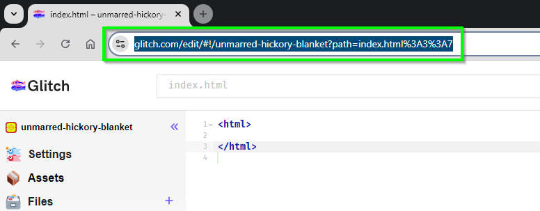
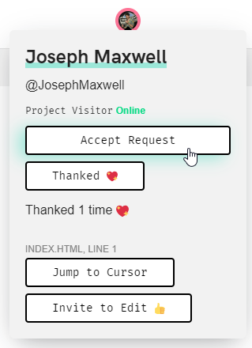

# Glitch Links
If you're a virtual student and you want help, it is recommended to submit your Glitch links and allow your instructors to join your projects. This will give them a real-time view into your code, and make it a lot easier for them to help you!

Simply copy the URL from your address bar...

...and paste it into one of the forms below. After that, an instructor will be able to visit your project and request to join it. You should see their avatar pop up in the upper right...

~

...where you'll be able to give them access. Click their icon to open up their profile view, and click the "Accept Request" button to give them access:

From there, the instructor will be able to view your updates, and even edit your code! They might add comments right in your files to guide you in the right direction.

## Forms for Each Course
Find the forms below.

- [Web 101 Link Submissions](https://forms.office.com/r/3dgkudTTGf)
- [Web 102 Link Submissions](https://forms.office.com/r/kwc3SK1XZS)
- [Web 103 Link Submissions](https://forms.office.com/r/Ygh1kVpEiw)
