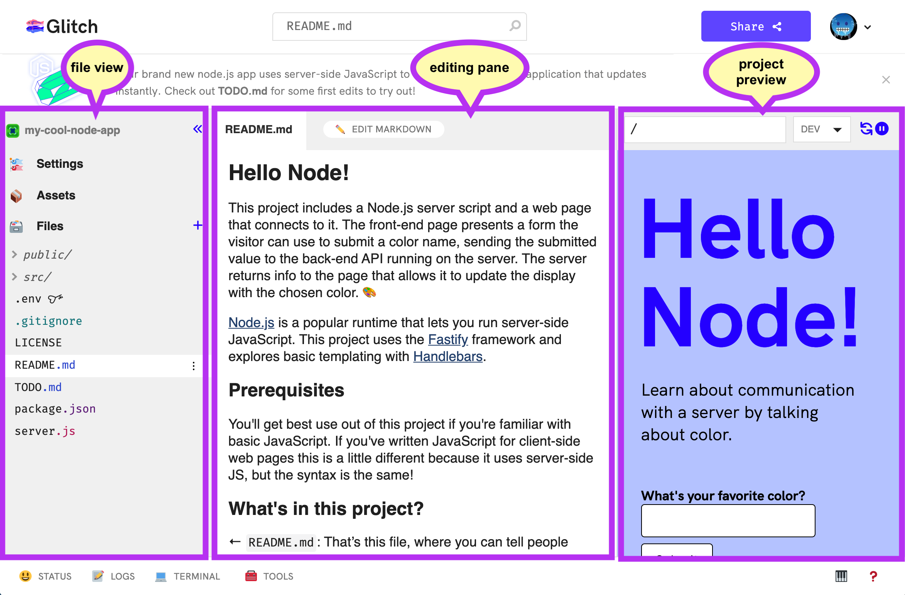

# Glitch Setup
[**Glitch.com**](https://glitch.com/) is a website that allows developers to _write_ and _run_ code right from a web browser! Create a Glitch account in order to save and share code projects.

## Creating an Account
Visit the [Glitch signup page](https://glitch.com/signup), and follow the prompts to create an account. Make sure you verify your email address!

## Getting Started with Glitch
[Click here for an introductory guide to Glitch.](https://help.glitch.com/hc/en-us/articles/16287564744461-Getting-Started-Part-1-The-Project-Editor)

The most important thing is being able to navigate through the project editor. Here's a quick rundown:

Basically, you can select files on the left, view and edit your code in the middle, and preview what you're building on the right (as long as you open the preview pane)!
