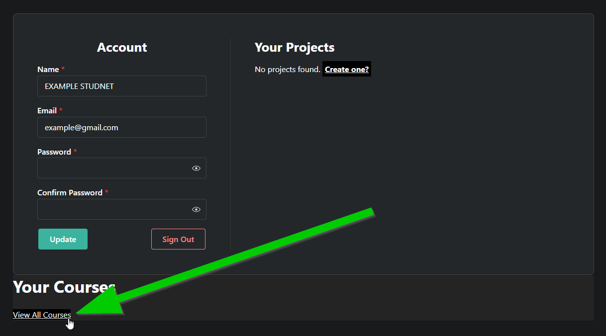
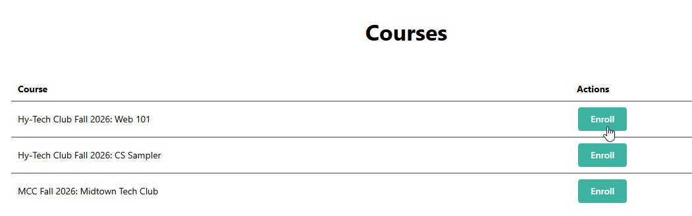

# HyTOP Setup
This semester, Hy-Tech Club will be utilizing a brand new bespoke web coding platform built specifically for Hyland: the **Hy**land **T**ech **O**utreach **P**ortal!

## Creating an Account
If you need an account, follow these steps:

1. [Click here to go to HyTOP](https://hytop.onrender.com/#register)
1. Fill out your real name, a valid email, a username, and password
1. Click the **Register** button

Make sure to remember your username and password - that's what you'll use to log into HyTOP week to week!

## Joining Your Course
In order to ease facilitation, enroll in your current course.

1. Navigate to your [profile](https://hytop.onrender.com/profile)  
  - You should be redirected automatically after creating an account
1. In the bottom left, click the "View All Courses" link  
  
1. Find your course, and click the "Enroll" button  
  

After that, an instructor will confirm your enrollment, and you'll be in the course!
