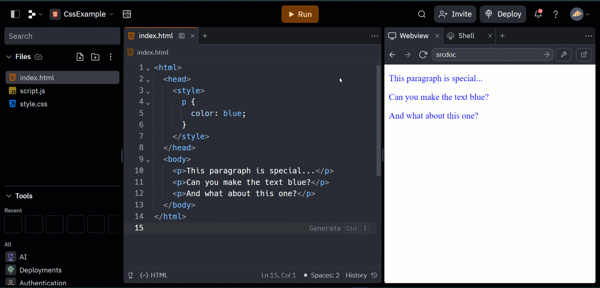

# Multiplayer Repl Links
Follow these instructions to share your Multiplayer Repl link. Overall, it looks something like this:

1. Click the "Invite" button in the upper right
1. Toggle the "Private join link" option
1. Click the "Copy join link" button
1. Paste the link into the appropriate form with `Ctrl`+`v` or `Cmd`+`v`

## Forms for Each Course
Find the forms below.

- [Web 101 Multiplayer Repl Submissions](https://forms.office.com/r/3dgkudTTGf)
- [Web 102 Multiplayer Repl Submissions](https://forms.office.com/r/kwc3SK1XZS)
- [Web 103 Multiplayer Repl Submissions](https://forms.office.com/r/Ygh1kVpEiw)
