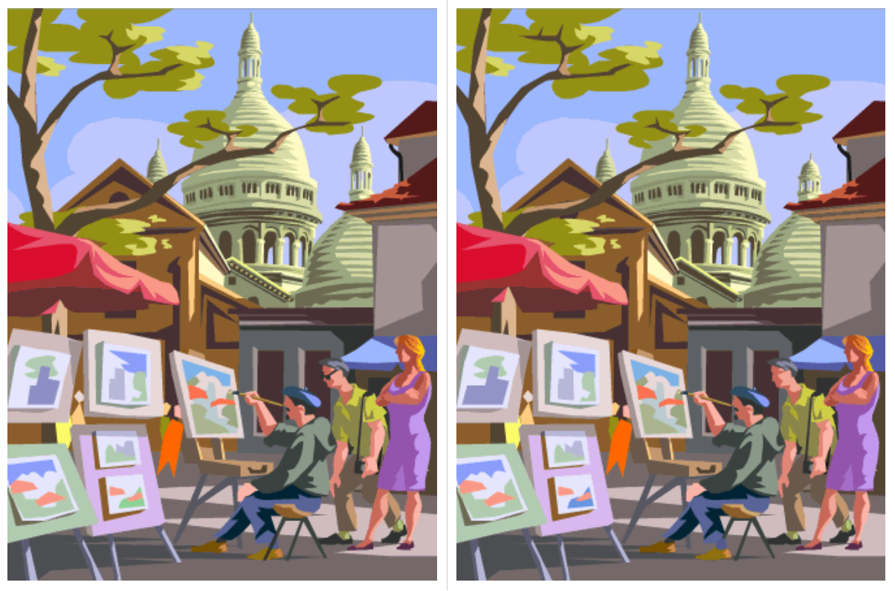

# Instructor One Puzzle
This puzzle is a simple spot-the-difference game. If the students successfully spot _every_ difference between the two pictures, they will be given the digit.

Print out this picture:

## Solution
Make sure the students find _all_ of the differences!

1. Branch
1. Leaves
1. Steeple
1. Circle Window
1. Roof Decoration
1. Tent Height
1. Building Painting Size
1. Mountain Painting Color
1. Chair Leg Location
1. Onlooker Glasses
