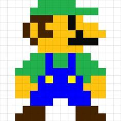

# Instructor Two Puzzle
This puzzle tasks students with creating a drawing on a pixel grid. In order to obtain the digit, they will have to name the subject of the picture. Print out the instructions for the students to follow. They should have access to blank grid paper and markers with the proper colors.

## Student Instructions
Each pixel has a `color` and a pair of `x` and `y` coordinates, like so: `Color | (x, y)`.

- The `color` represents the color of the pixel
- The `x` represents the horizontal position
  - `0` on the left edge, `15` on the right edge
- The `y` represents the vertical position
  - `0` on the top edge, `15` on the bottom edge

Color in each pixel at the proper position on the grid to unlock the secret picture!

### Pixel List
Here is the full list of pixels:

| Color | Position |
|-|-|
| Green | `( 5, 0)` |
| Green | `( 6, 0)` |
| Green | `( 7, 0)` |
| Green | `( 8, 0)` |
| Green | `( 9, 0)` |
| Green | `( 4, 1)` |
| Green | `( 5, 1)` |
| Green | `( 6, 1)` |
| Green | `( 7, 1)` |
| Green | `( 8, 1)` |
| Green | `( 9, 1)` |
| Green | `(10, 1)` |
| Green | `(11, 1)` |
| Green | `(12, 1)` |
| Green | `( 4, 7)` |
| Green | `( 5, 7)` |
| Green | `( 7, 7)` |
| Green | `( 8, 7)` |
| Green | `(10, 7)` |
| Green | `(11, 7)` |
| Green | `( 3, 8)` |
| Green | `( 4, 8)` |
| Green | `( 5, 8)` |
| Green | `( 7, 8)` |
| Green | `( 8, 8)` |
| Green | `(10, 8)` |
| Green | `(11, 8)` |
| Green | `(12, 8)` |
| Green | `( 2, 9)` |
| Green | `( 3, 9)` |
| Green | `( 4, 9)` |
| Green | `( 5, 9)` |
| Green | `(10, 9)` |
| Green | `(11, 9)` |
| Green | `(12, 9)` |
| Green | `(13, 9)` |
| Green | `( 4,10)` |
| Green | `(11,10)` |
| Black | `( 4, 2)` |
| Black | `( 5, 2)` |
| Black | `( 6, 2)` |
| Black | `( 9, 2)` |
| Black | `( 3, 3)` |
| Black | `( 5, 3)` |
| Black | `( 9, 3)` |
| Black | `( 3, 4)` |
| Black | `( 5, 4)` |
| Black | `( 6, 4)` |
| Black | `(10, 4)` |
| Black | `( 4, 5)` |
| Black | `( 9, 5)` |
| Black | `(10, 5)` |
| Black | `(11, 5)` |
| Black | `(12, 5)` |
| Black | `( 3,14)` |
| Black | `( 4,14)` |
| Black | `( 5,14)` |
| Black | `(10,14)` |
| Black | `(11,14)` |
| Black | `(12,14)` |
| Black | `( 2,15)` |
| Black | `( 3,15)` |
| Black | `( 4,15)` |
| Black | `( 5,15)` |
| Black | `(10,15)` |
| Black | `(11,15)` |
| Black | `(12,15)` |
| Black | `(13,15)` |
| Yellow | `( 7, 2)` |
| Yellow | `( 8, 2)` |
| Yellow | `( 4, 3)` |
| Yellow | `( 6, 3)` |
| Yellow | `( 7, 3)` |
| Yellow | `( 8, 3)` |
| Yellow | `(10, 3)` |
| Yellow | `(11, 3)` |
| Yellow | `(12, 3)` |
| Yellow | `( 4, 4)` |
| Yellow | `( 7, 4)` |
| Yellow | `( 8, 4)` |
| Yellow | `( 9, 4)` |
| Yellow | `(11, 4)` |
| Yellow | `(12, 4)` |
| Yellow | `(13, 4)` |
| Yellow | `( 5, 5)` |
| Yellow | `( 6, 5)` |
| Yellow | `( 7, 5)` |
| Yellow | `( 8, 5)` |
| Yellow | `( 5, 6)` |
| Yellow | `( 6, 6)` |
| Yellow | `( 7, 6)` |
| Yellow | `( 8, 6)` |
| Yellow | `( 9, 6)` |
| Yellow | `(10, 6)` |
| Yellow | `( 2,10)` |
| Yellow | `( 3,10)` |
| Yellow | `( 6,10)` |
| Yellow | `( 9,10)` |
| Yellow | `(12,10)` |
| Yellow | `(13,10)` |
| Yellow | `( 2,11)` |
| Yellow | `( 3,11)` |
| Yellow | `( 4,11)` |
| Yellow | `(11,11)` |
| Yellow | `(12,11)` |
| Yellow | `(13,11)` |
| Yellow | `( 2,12)` |
| Yellow | `( 3,12)` |
| Yellow | `(12,12)` |
| Yellow | `(13,12)` |
| Blue | `( 6, 7)` |
| Blue | `( 9, 7)` |
| Blue | `( 6, 8)` |
| Blue | `( 9, 8)` |
| Blue | `( 6, 9)` |
| Blue | `( 7, 9)` |
| Blue | `( 8, 9)` |
| Blue | `( 9, 9)` |
| Blue | `( 5,10)` |
| Blue | `( 7,10)` |
| Blue | `( 8,10)` |
| Blue | `(10,10)` |
| Blue | `( 5,11)` |
| Blue | `( 6,11)` |
| Blue | `( 7,11)` |
| Blue | `( 8,11)` |
| Blue | `( 9,11)` |
| Blue | `(10,11)` |
| Blue | `( 4,12)` |
| Blue | `( 5,12)` |
| Blue | `( 6,12)` |
| Blue | `( 7,12)` |
| Blue | `( 8,12)` |
| Blue | `( 9,12)` |
| Blue | `(10,12)` |
| Blue | `(11,12)` |
| Blue | `( 4,13)` |
| Blue | `( 5,13)` |
| Blue | `( 6,13)` |
| Blue | `( 9,13)` |
| Blue | `(10,13)` |
| Blue | `(11,13)` |

## Solution
The picture they are trying to draw is this:

The name is Luigi!