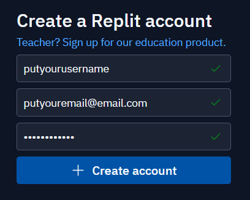
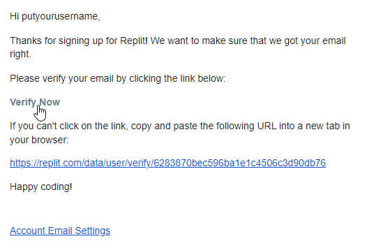
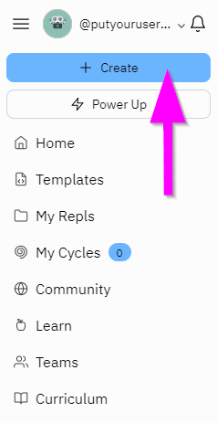
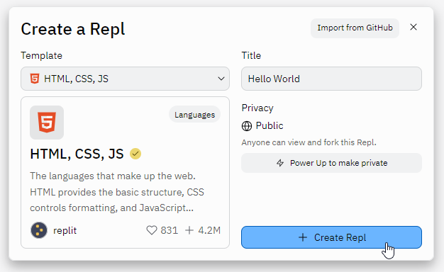
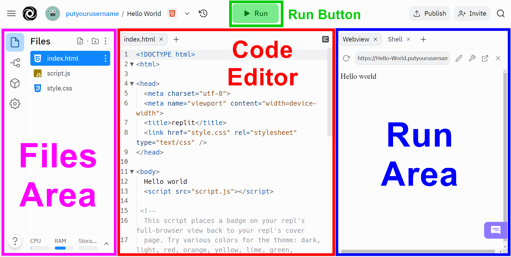

# Replit Setup
**Replit.com** is a website that allows developers to _write_ and _run_ code right from a web browser! Create a Replit account in order to save and share code projects.

>Note: throughout these instructions, there may be interactive Replit tutorials. Be sure to read through those helpful tips in addition to reading through this guide!

## Creating an Account
Follow the steps below to create a Repl account.

1. Go to [the Replit sign-up page](https://replit.com/signup)
1. Fill out a username, email, and password, and click the "+ Create account" button  
    
    - Alternatively, continue with Google, GitHub, or Facebook
1. If necessary, prove your humanity to verify the account
1. Walk through the onboarding process, or skip if desired
1. Open your email, and click the "Verify Now" link  
    

That's it! You now have a Repl account 😊

## Creating a Repl Project
On Replit, you can make a lot of different things. To work on something new, you'll want to create a **Repl Project** (also simply called a **Repl**). This will be where you store all of the code for your project, be it a website, C# application, or Python script!

1. On your [Repls](https://replit.com/repls) page, on the left side, click the "+ Create" button  
    
1. Select a Template (like "HTML, CSS, JS")
1. Enter a Title for the Repl, like "Hello World"
1. Click the "+ Create Repl" button to create the new project!  
    

That's it! You now have a Repl project 😊

## Repl Editor Overview
When opening a new Repl project for the first time, an interactive tutorial may appear. If that happens, be sure to read through the information; it will explain the how Replit works in detail.

Here is a quick rundown of the different areas of the Repl editor:

- **Files Area** - This is where developers select and update files
- **Code Editor** - This is where developers write code
- **Run Button** - Developers click this button to _execute_ the code
- **Run Area** - This is where the developer sees the results of the code

In the new repl, click the "Run" button to see the code execute. In the case of an **HTML, CSS, JS** repl, the page might say "Hello world" in the Run Area.

### TIP - Boiler-plate Code
At the moment, there may be some "boiler-plate" code in the editor. Don't worry about that for now; you do not need to understand any of it yet!

## Conclusion
At this point you should be good to go, and ready to start developing on Replit! Make sure to remember your Replit username and password - those credentials will allow you to keep track of all your projects 😊