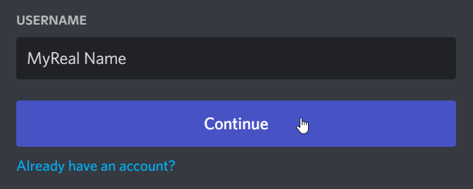
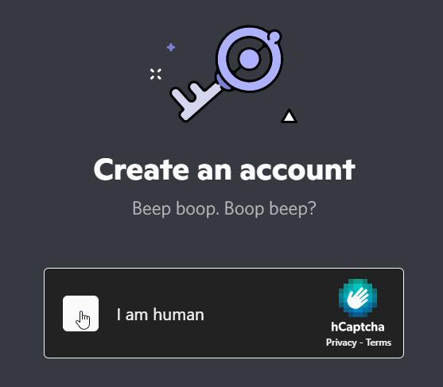
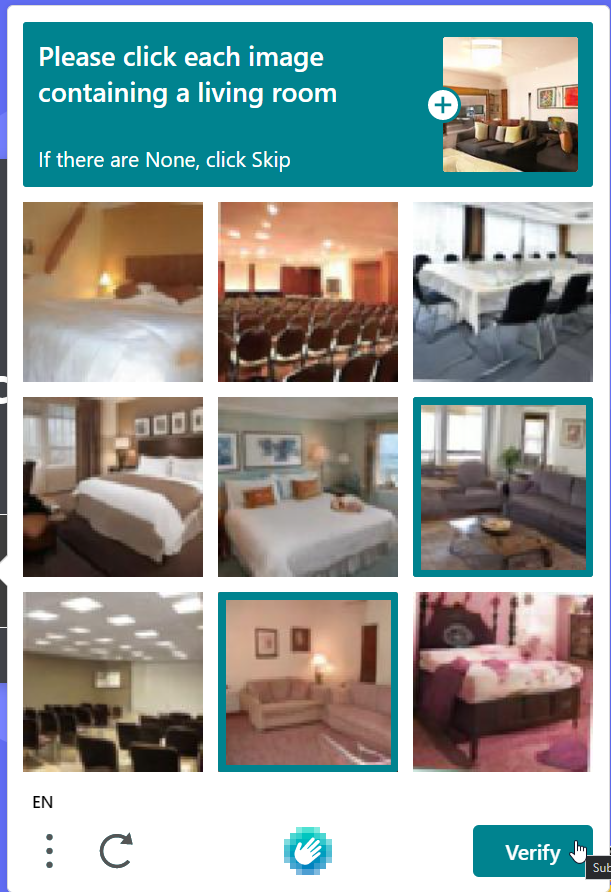
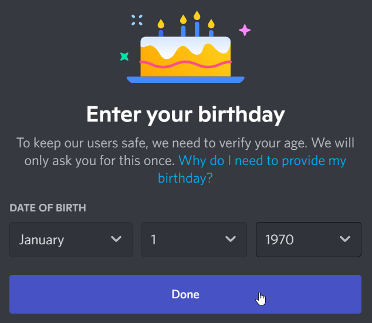
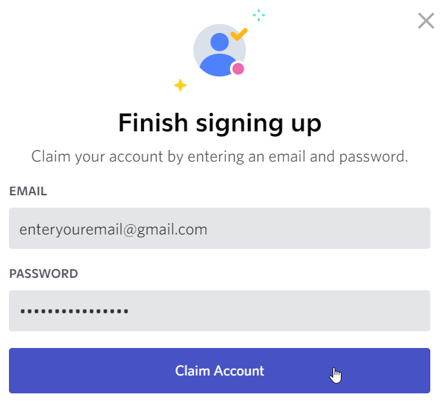
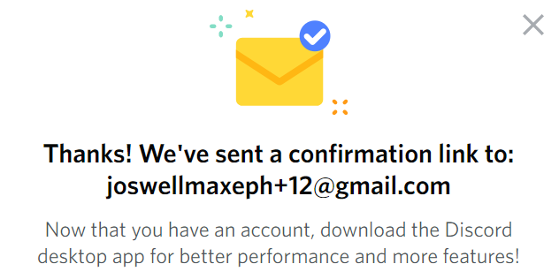
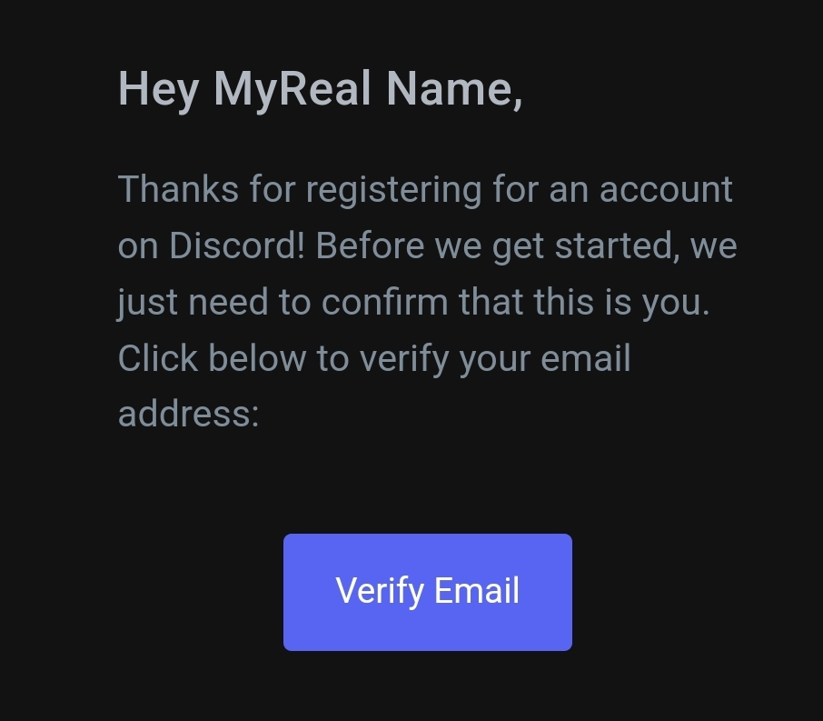
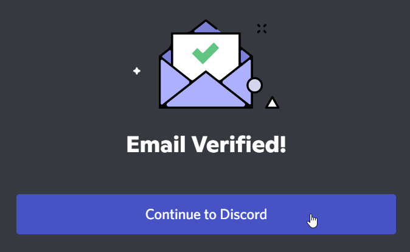

# Discord Use
Hyland's High School Innovation Showdown will use [Discord](https://discord.com/) as a way for students and mentors to communicate outside of designated meeting times.

[Click here to join the server!](https://discord.gg/MNcWWwTS6v)

## Parent/Guardian Consent Form Agreement 
As noted in the consent form that was signed by parents or guardians prior to participating in the Showdown, each student has agreed to the following regarding the use of Discord: 

>I agree and understand that Hyland may provide for the use of certain unaffiliated third party websites or applications (“Third Party Sites”) in connection with the Program. I understand that use of these Third Party Sites is optional. If I choose to permit my child(ren) to use such Third Party Sites, I further understand and agree that: (i) the Third Party Site may collect personal information directly from my child(ren) subject to the terms and conditions (including an applicable privacy policy) available on the Third Party Site; and (ii) Hyland does not control these Third Party Sites and is not responsible for their information collection practices. 

## Additional Guidelines
- The usage of Discord is **not** required. If you do not want to use it, you will still be able to participate in the Showdown.
- You must use your _real first and last name_ when communicating on Discord. If we see an account that does not have a real student name, the account will be kicked.
- If you say anything inappropriate, you will be banned from the server and may be removed from the competition.
- Please be respectful of all students and mentors while communicating on Discord.
- Mentors will check Discord throughout the week during business hours, so feel free to post any time!

## Server Categories & Channels
We have one Discord Server for the whole of the Innovation Showdown. This means that students will be able to interact across teas.

There are several channels in the server. Please be mindful of each channel's purpose.

### GENERAL Channels
Channels in the **GENERAL** category are available to _all_ students in the competition, from any team.

#### announcements
Competition facilitators will post important messages in this channel. Students will not be able to post.

#### chat
Students can use this channel to connect with each other socially. Conversations should be appropriate and relevant to the competition, and can be a good way for students to get to know each other.

#### questions
Students are welcome to ask questions about the competition in this channel.

#### off-topic
General discussions unrelated to the Showdown will take place in this channel. Be sure to keep it civil, or this channel may be removed.

### TEAM CHATS Channels
There will be one dedicated channel for each team within the **TEAM CHATS** category. Using these channels, teams will be able to communicate amongst themselves and with their assigned mentor.

## Setup
To use Discord, you must first set up an account. Start by clicking the invite link, and then follow the steps below.

**Enter your _first and last name_ and click the "Continue" button to create an account.**  

>Note that if you already have an account, you can use it, but be sure to [change your nickname](https://support.discord.com/hc/en-us/articles/219070107-Server-Nicknames) to your real first and last name.

**Next, complete the Captcha if necessary.**

**On the next screen, enter your birthday.** Note that you will not be able to use Discord if you are under 13 years of age.  

**On the next pop-up, enter an e-mail and password.** Be sure to remember your password.

An email verification message should appear.  

**Open your email account, and there should be a new message from Discord. Open the message, and click the "Verify Email" button.**  

Clicking the button should open a webpage. There should be an "Email Verified" message. **Click the "Continue to Discord" button to continue.**  

